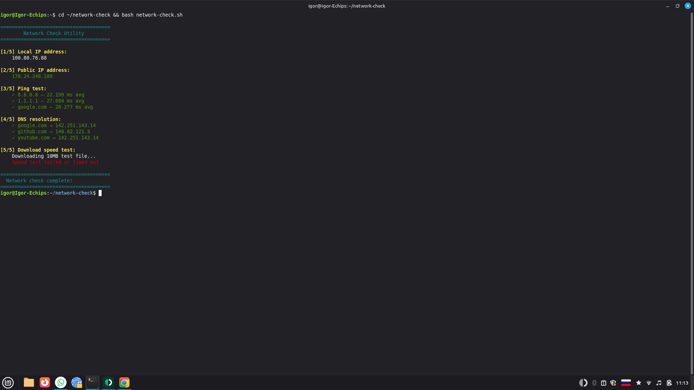

# 🌐 Network Check Utility

A Bash script to quickly check your network status: local/public IP, ping, DNS, and download speed.

## Result



## What it does

- Shows local IP address
- Shows public IP address (via api.ipify.org)
- Pings 3 hosts: 8.8.8.8, 1.1.1.1, google.com
- Checks DNS resolution for google.com, github.com, youtube.com
- Tests download speed (10MB file from Hetzner)

## Usage

```bash
git clone https://github.com/IgorUspehov/network-check.git
cd network-check
chmod +x network-check.sh
bash network-check.sh
```

## Desktop shortcut (Linux Mint / Ubuntu)

```bash
cat > ~/Desktop/Network-Check.desktop << 'EOF'
[Desktop Entry]
Version=1.0
Type=Application
Name=🌐 Network Check
Comment=Check internet speed and ping
Exec=bash -c 'bash "/home/igor/network-check/network-check.sh"; echo ""; echo "Press Enter to close..."; read'
Terminal=true
Icon=network-workgroup
Categories=Network;Utility;
